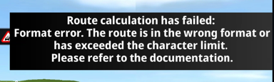

# sygic-professional-sdk-standalone-demo-android

Demo app for [Standalone integration using Android Studio](https://www.sygic.com/developers/professional-navigation-sdk/android/getting-started/standalone-integration-using-android-studio).

The code provided in this repository is intended solely for the purpose of demonstrating how an API works and should not be considered production-ready or suitable for use in real-world applications.

### FORK DESCRIPTION

This fork provides a code for reproducing an issue with importing Precomputed Route JSON from
String and passing it further to the standalone Sygic application. When we provide such JSON
a banner is displayed in the app:

[Error stacktrace](error_stacktrace.txt)

Please see changes in [NaviFragment](./app/src/main/java/com/sygic/example/ipcdemo3d/fragments/NaviFragment.java)) btn_start_foreg button click listener and JSON used to
reproduce the issue in [JsonSamples.java](./app/src/main/java/com/sygic/example/ipcdemo3d/fragments/JsonSamples.java) file.
The code for importing file was taken from this documentation page:
https://www.sygic.com/developers/professional-navigation-sdk/android/api-examples/settings-api

How to reproduce:
1. Build and launch the app
2. Click CONNECT SYGIC SERVICE
3. Once connected click BRING NAVI TO FOREG
   **Actual result:** Fleet app is opened and error banner is displayed
   **Expected result:** Fleet app is opened and precomputed route navigation is started 

Worth mentioning is that I've used Android 15.